# Sandesh Khabar

An online news portal commited to deliver value, correct information and truly empowers the
citizens with the truth.

## Short Glimpse of Sandesh Khabar

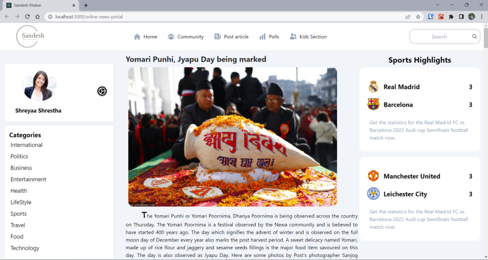

## Project Hierarchy

We have the following project heirachary.

## Project Workflow

### We two main folders

1. Admin Portal
   Where Admin
   - can create the news and save in database
   - can update the news of database and save
   - can delete the news from database
2. User Portal
   Where the users
   - can read the different categories of Latest News

### Admin have a seperate interface to login and perform above actions and User of our Sandesh Khabar can visit the newsite in other interface (website) to read the latest news

# Screenshots

## For Users

1. Homepage
   

2. International (Category Section Pick)
   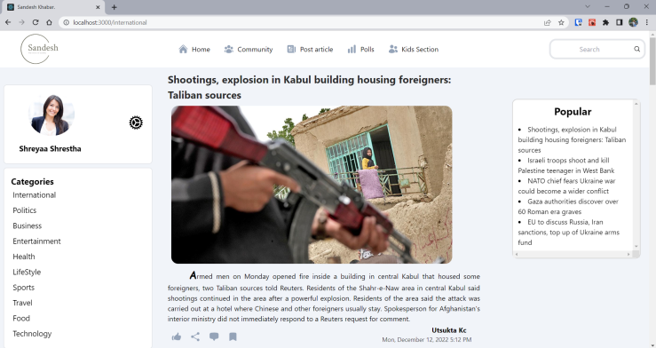

3. Community for our readers
   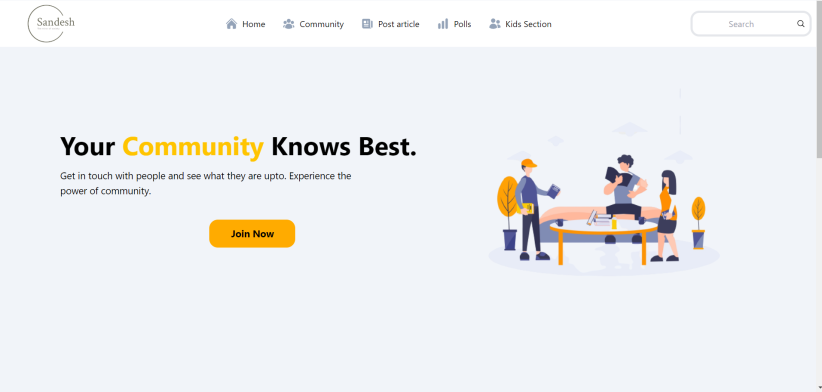

4. Polls as our readers voice matters
   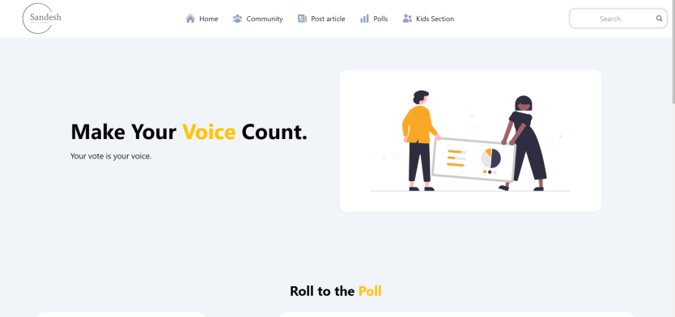

5. Kidsland, to serve the most precious ones
   
   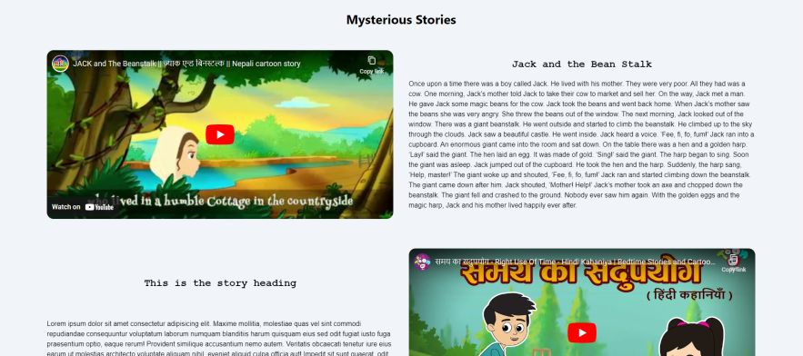

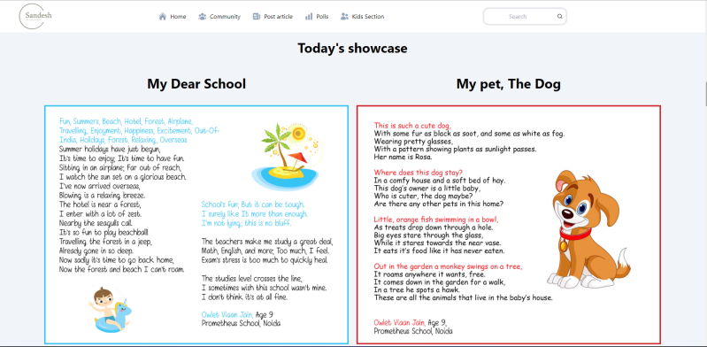

## For Admin

1. Login Page

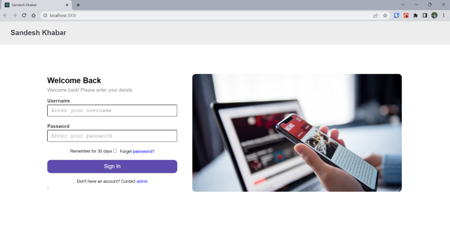

2. Admin Portal Homepage

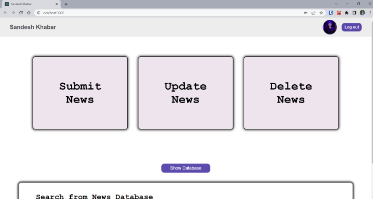

3. Submit News

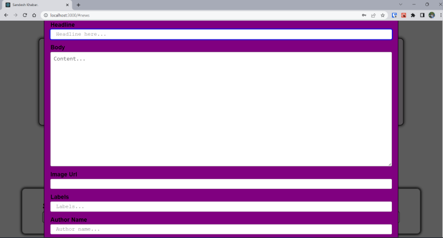

4. Update News

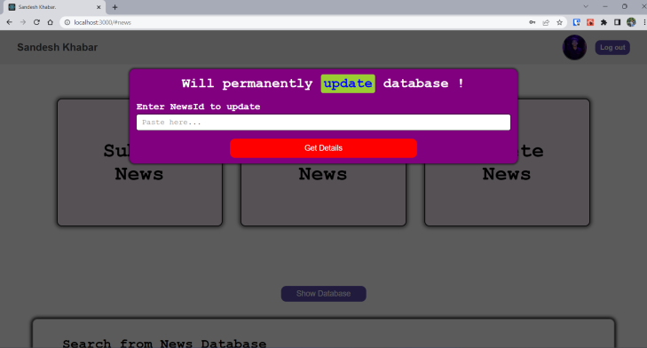

5. Delete News

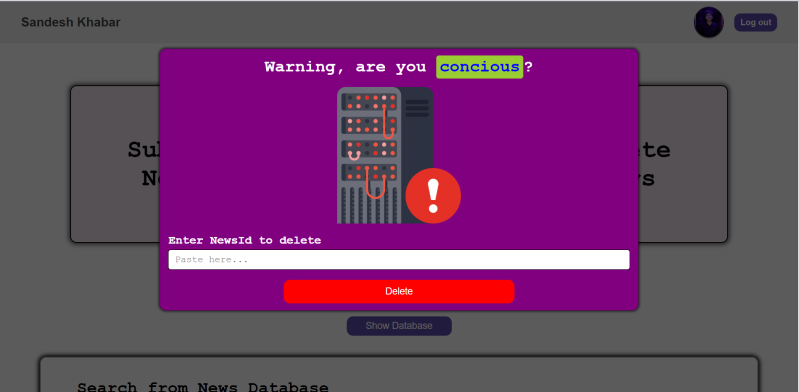

## Tech Stack used

1. Frontend

   - HTML
   - CSS
   - JAVASCRIPT
   - REACT

2. Backend
   - Node.js
   - Express.js
   - Mongo DB ATLAS

## Made with 💙 by HackO'Holics
